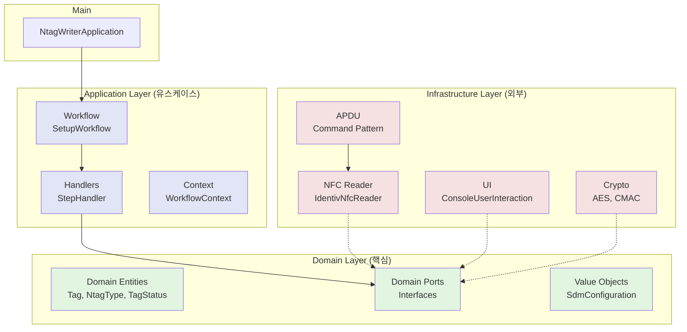
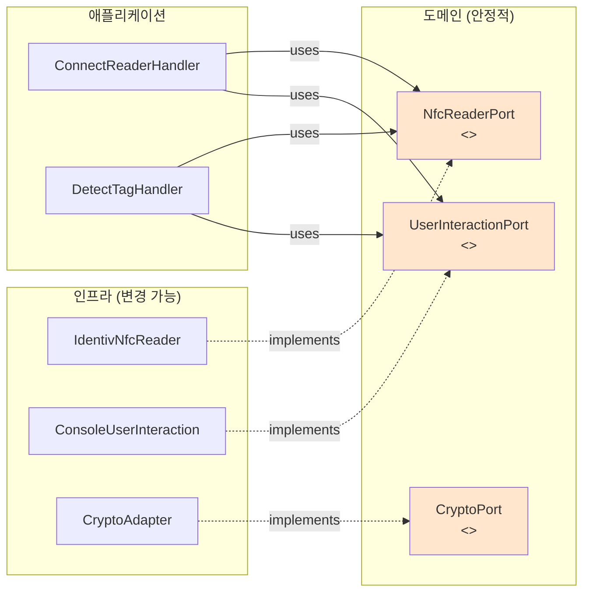
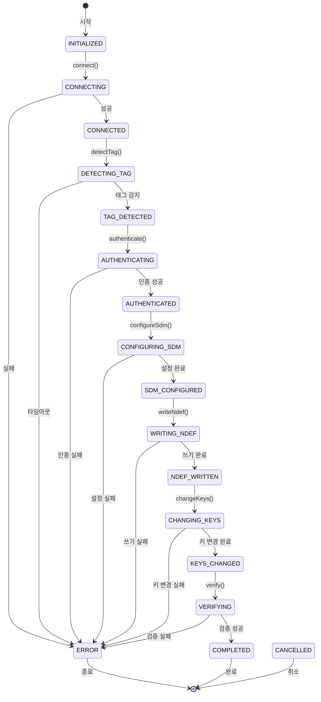
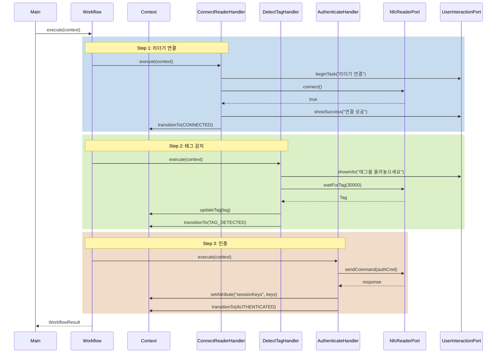
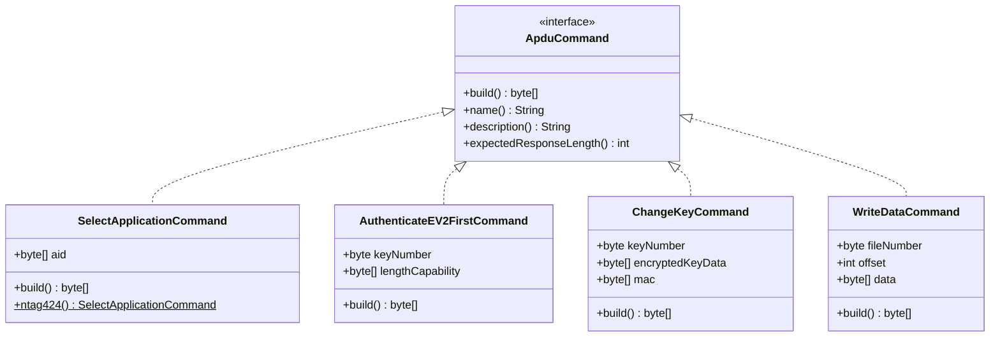
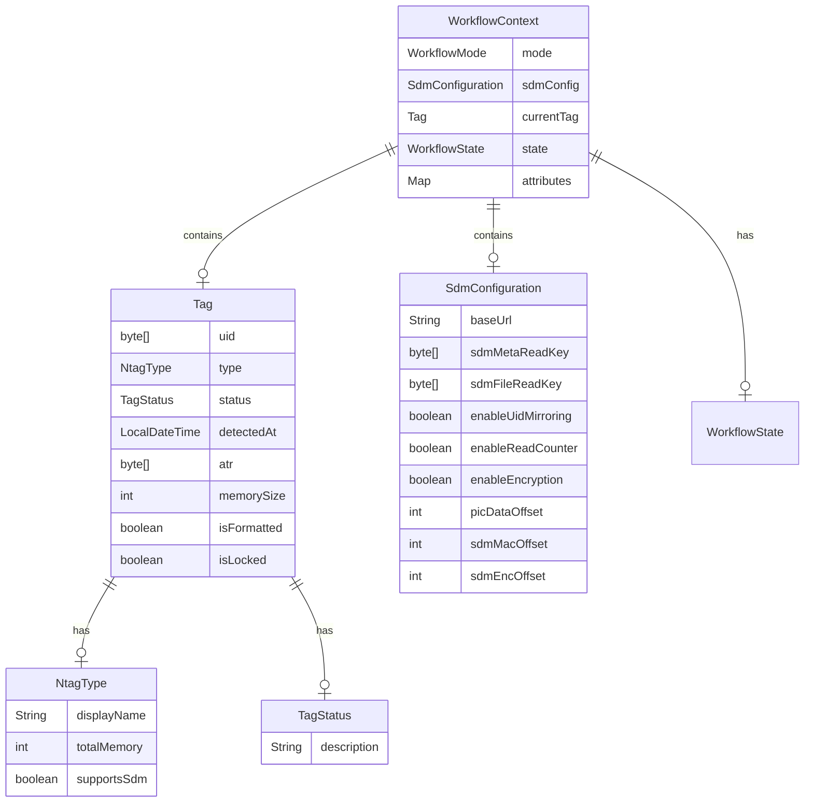

# NTAG Writer 아키텍처 문서

## 1. 클린 아키텍처 레이어 구조



## 2. 의존성 역전 원칙 (DIP)



## 3. 워크플로우 상태 다이어그램



## 4. 핸들러 체인 패턴



## 5. APDU Command 패턴 구조



## 6. 도메인 모델 관계



## 7. 패키지 구조

```
src/main/java/ntagwriter/
├── domain/                    # 도메인 레이어 (핵심 비즈니스)
│   ├── port/                  # 포트 인터페이스 (의존성 역전)
│   │   ├── NfcReaderPort
│   │   ├── UserInteractionPort
│   │   └── CryptoPort
│   ├── tag/                   # 태그 관련 도메인 모델
│   │   ├── Tag
│   │   ├── NtagType
│   │   └── TagStatus
│   └── config/                # 설정 값 객체
│       └── SdmConfiguration
│
├── application/               # 애플리케이션 레이어 (유스케이스)
│   ├── workflow/              # 워크플로우 관리
│   │   ├── SetupWorkflow
│   │   ├── WorkflowContext
│   │   ├── WorkflowState
│   │   ├── WorkflowMode
│   │   └── WorkflowResult
│   └── handler/               # 단계별 핸들러
│       ├── StepHandler
│       ├── ConnectReaderHandler
│       ├── DetectTagHandler
│       └── AuthenticateHandler
│
├── infrastructure/            # 인프라스트럭처 레이어 (외부 연동)
│   ├── nfc/                   # NFC 관련
│   │   ├── reader/
│   │   │   └── IdentivNfcReader
│   │   └── apdu/              # APDU 명령
│   │       ├── ApduCommand
│   │       ├── SelectApplicationCommand
│   │       └── AuthenticateEV2FirstCommand
│   ├── ui/                    # 사용자 인터페이스
│   │   └── ConsoleUserInteraction
│   └── persistence/           # 영속성 (추후 구현)
│       └── FileConfigRepository
│
├── crypto/                    # 암호화 유틸리티 (기존)
│   ├── AesEncryption
│   ├── CmacCalculator
│   ├── ByteRotation
│   └── SecureMessaging
│
└── util/                      # 공통 유틸리티
    ├── HexUtils
    └── LoggerHelper
```

## 8. 주요 설계 원칙

### 8.1 SOLID 원칙 적용

- **S**RP (단일 책임): 각 클래스는 하나의 책임만 가짐
- **O**CP (개방-폐쇄): 확장에는 열려있고 수정에는 닫혀있음
- **L**SP (리스코프 치환): 인터페이스 구현체는 상호 교체 가능
- **I**SP (인터페이스 분리): 작고 구체적인 인터페이스
- **D**IP (의존성 역전): 추상화에 의존, 구체화에 의존하지 않음

### 8.2 패턴 적용

- **포트/어댑터 패턴**: 도메인과 인프라 분리
- **전략 패턴**: StepHandler로 각 단계 캡슐화
- **커맨드 패턴**: APDU 명령 객체화
- **빌더 패턴**: SdmConfiguration, WorkflowResult
- **불변 객체 패턴**: 도메인 엔티티의 불변성 보장

### 8.3 코드 품질

- **매직넘버 제거**: 모든 상수 명시적 정의
- **명확한 변수명**: 의미있는 이름 사용
- **불변성**: public final 필드, no setter
- **순수 함수**: 부작용 최소화