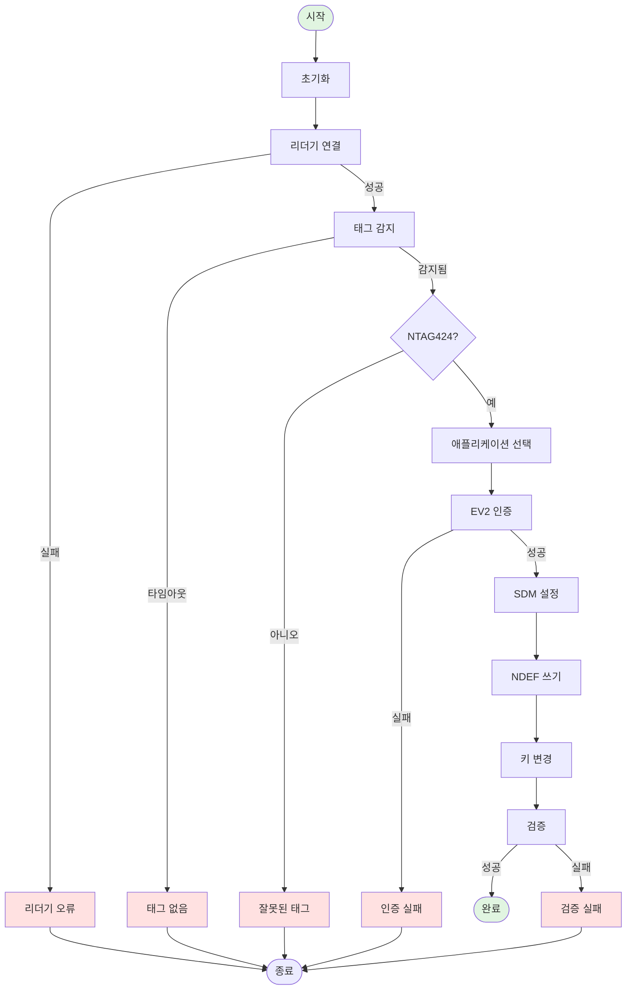
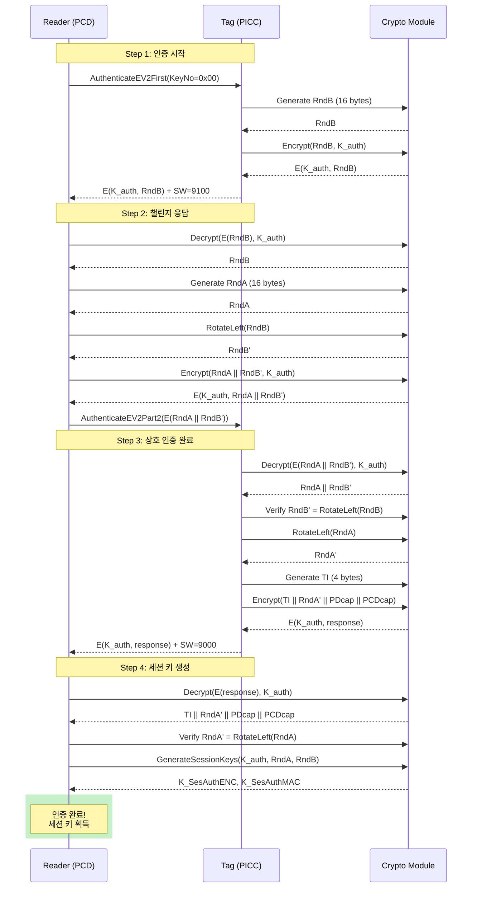
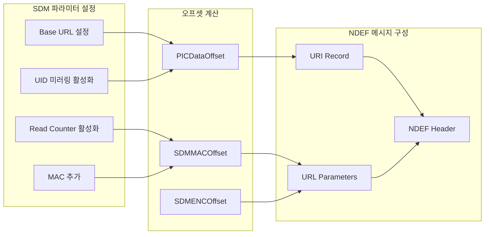
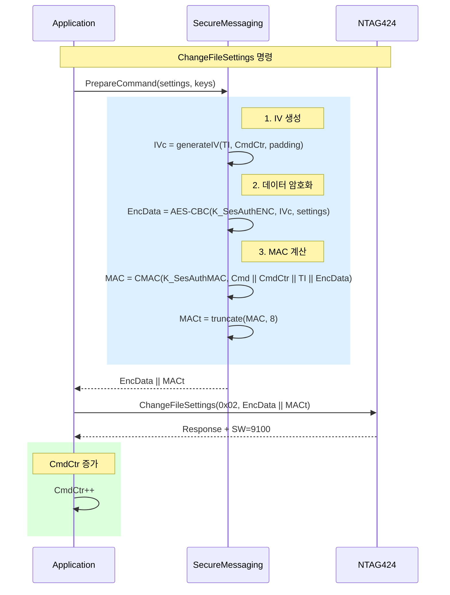
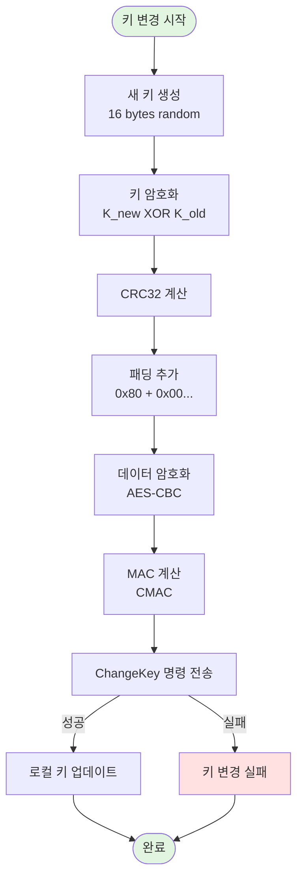
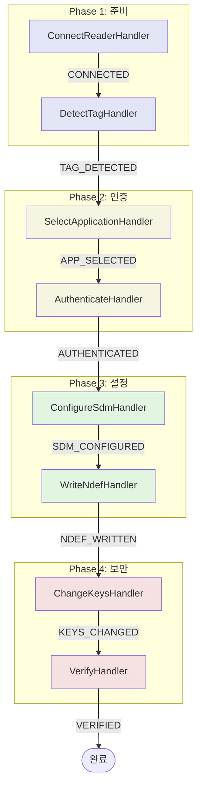
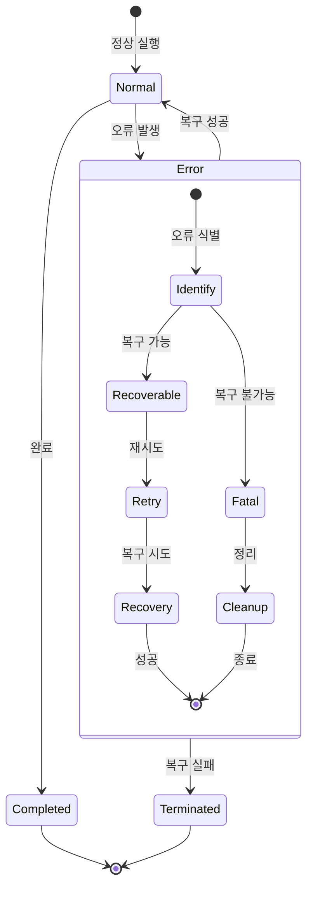
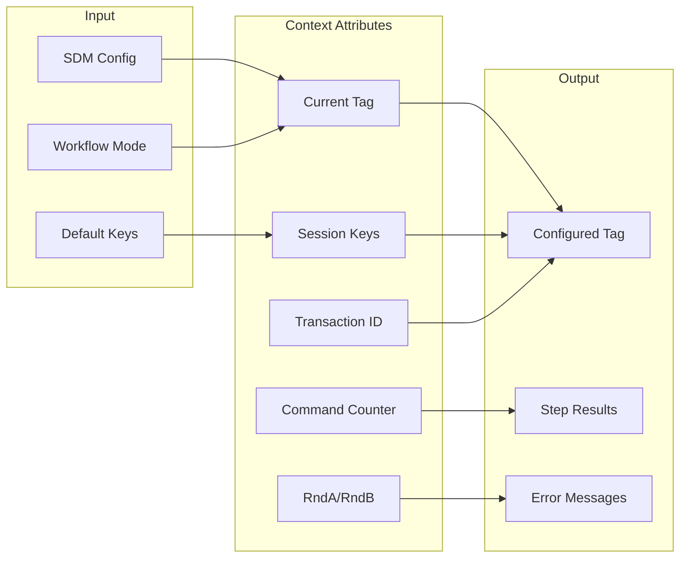

# NTAG424 DNA 설정 워크플로우

## 1. 전체 워크플로우 개요

## 2. EV2 인증 프로세스

## 3. SDM (Secure Dynamic Messaging) 설정

## 4. 보안 메시징 프로토콜

## 5. 키 변경 프로세스

## 6. 핸들러 실행 순서

## 7. 오류 처리 및 복구

## 8. 워크플로우 모드별 동작

| 모드 | 설명 | 사용자 개입 | 적용 시나리오 |
|------|------|------------|--------------|
| **INTERACTIVE** | 대화형 모드 | 각 단계마다 확인 요청 | 개발/디버깅 |
| **AUTOMATIC** | 자동 모드 | 개입 없음 | 대량 처리 |
| **STEP_BY_STEP** | 단계별 모드 | 단계 완료 후 대기 | 교육/데모 |

## 9. 컨텍스트 데이터 흐름

## 10. 성능 고려사항

| 단계 | 예상 시간 | 병목 요소 | 최적화 방안 |
|------|----------|----------|------------|
| 리더기 연결 | < 1초 | USB 초기화 | 연결 풀링 |
| 태그 감지 | 0.5-30초 | 사용자 액션 | 시각/청각 피드백 |
| 인증 | < 0.5초 | 암호화 연산 | 세션 키 캐싱 |
| SDM 설정 | < 1초 | APDU 통신 | 배치 명령 |
| NDEF 쓰기 | < 2초 | 메모리 쓰기 | 청크 단위 쓰기 |
| 키 변경 | < 1초 | 암호화 연산 | 병렬 처리 |
| 검증 | < 1초 | 읽기/비교 | 체크섬 활용 |

**총 예상 시간**: 5-40초 (태그 감지 시간에 따라 변동)